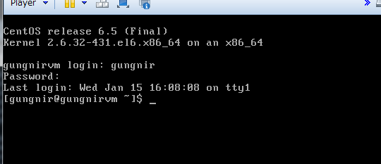

# genn.ai サーバー仮想マシンの利用方法
このサイトで配布している仮想マシンイメージを使用することで、dev.genn.aiで提供している環境をローカルの環境で試すことができます。このページではgungnirクライアントで接続してtutorialを試せるところまでをご説明いたします。

## 環境の前提
仮想マシンを動かす環境の前提を以下に記載しますので、
これらをご準備頂くか、またはご自身の環境に合わせて読み替えてご利用ください。

**ホスト情報**

- OS：Windows 7 sp1
- Intel-VTまたはAMD-V に対応したCPU(BIOS設定にて有効化してください)
- 仮想マシンが使用する分の空きメモリ
- 仮想マシンが使用する分のストレージ(NTFS)

**使用ソフトウェア**

- VMware Player 5.0.x

**仮想マシン情報**

- CentOS6.5 x86_64
- メモリ：768MBを割り当て
- ストレージ(最大)：20GB割当て※  
- Gungnirサーバー
- Gungnirクライアント
- MongoDB 2.2.7
- Kafka 0.8.0
- Zookeeper 3.4.5
- Oracle JDK 1.6.0_45

　※仮想マシンイメージファイルは4GBを超える可能性がありますのでFAT/FAT32フォーマットのディスクへは配置しないでください。

## 環境の構築
環境の構築は仮想マシンイメージファイルをVMware Playerで開き、「仮想マシンの起動」を行うだけで完了します。

１．仮想マシンイメージファイルのダウンロード

　ダウンロードは [http://pages.genn.ai/download/](http://pages.genn.ai/download/) から行えます。ダウンロードしましたら、任意のフォルダへ展開してください。

２．仮想マシンの起動

　VMware Playerで先ほどの仮想マシンイメージを開き、「仮想マシンの再生」で起動します。
起動する際の「VMイメージファイルを、コピーしました／移動しました」の問いには、「移動しました」を選択してください。

３．サーバープロセスの起動

　すべてのサーバープロセスは自動で起動しますので、仮想マシンが起動した後はすぐにgungnirクライアントを使用することができます。

## 使ってみよう
ここでは、[チュートリアル](./tutorial_ja.html) を仮想マシン上で実施するための手順をご説明いたします。

１．仮想マシンへログイン

　VMware Playerのコンソールから、ユーザ：gungnir 、パスワード：gungnir でログインします。  
　

２．gungnirサーバーへログイン

　`gungnir`コマンドを使用して、gungnirサーバーへログインします。初期状態ではrootユーザのみが登録されています。パスワードは gennai となっています。

    $ gungnir -u root -p gennai
    Gungnir server connected... localhost/127.0.0.1:9190
    Gungnir version 0.0.1 build at 20140212-111352
    Welcome root
    gungnir>

３．gungnirアクセスユーザの作成

　rootユーザーでもTOPOLOGYの作成はできますが、ここでは作業ユーザを作成してそのユーザでチュートリアルを行っていきます。ユーザを作成するにはCREATE USERコマンドを使用します。

    gungnir> CREATE USER 'gennaitaro' IDENTIFIED BY '167668259f3e';

４．作成したユーザでログイン

　３で作成したユーザでログインしますが、その前にrootユーザからはログアウトしましょう。

    gungnir> quit;
    
    $

　再び`gungnir`コマンドを使用して、gennaitaro ユーザでログインします。

    $ gungnir -u gennaitaro -p 167668259f3e
    Gungnir server connected... localhost/127.0.0.1:9190
    Gungnir version 0.0.1 build at 20140212-111352
    Welcome gennaitaro
    gungnir>

５．チュートリアルを試してみよう！

　４．でログインした gungnirコンソールで [チュートリアル](./tutorial_ja.html) を行うことができます。ぜひお試しください！  

> チュートリアル文中にあるドメイン名(dev.genn.ai)は 127.0.0.1 と読み替えてください

## 参考情報

１．rootで作業したい

　gungnirユーザにはsudo権限が付与されています。`sudo su -`コマンドを使用してrootにスイッチできます。

    $ sudo su -
    [sudo] password for gungnir:
    #

２．ホストOS上からssh経由で仮想マシンにログインしたい

　まず、VMware Player コンソールからログインして、`ifconfig`コマンドを使用してIPアドレスを確認してください。

    $ /sbin/ifconfig
    eth0      Link encap:Ethernet  HWaddr 00:0C:FE:FE:FE:FE
              inet addr:192.168.1.99  Bcast:192.168.1.255  Mask:255.255.255.0
              inet6 addr: fe80::20c:feff:fe2c:aaaa/64 Scope:Link
              UP BROADCAST RUNNING MULTICAST  MTU:1500  Metric:1
              RX packets:35305 errors:0 dropped:0 overruns:0 frame:0
              TX packets:20981 errors:0 dropped:0 overruns:0 carrier:0
              collisions:0 txqueuelen:1000
              RX bytes:2330510 (2.2 MiB)  TX bytes:2734358 (2.6 MiB)
    
    lo        Link encap:Local Loopback
        (省略)
    
    $

　次に、ホストOS上から `ssh gungnir@<仮想マシンのIP)>` でログインします。なお、ssh経由では、rootユーザでログインできません。
root権限を必要とする作業を行いたい場合は、gungnir ユーザでログインしたあとに `sudo su -`コマンドを使用して rootユーザにスイッチしてください。

３．gungnirサーバープロセスを再起動したい

　各サーバープロセスの停止や起動は`service`コマンドを使用します。また、gungnirサーバー(gungnir-server)は その他の３つのサービスに依存していますので停止するときは最初に、起動するときは最後に実施してください。

    $ sudo su -
    # service gungnir-server stop
    # service mongod         stop
    # service kafka          stop
    # service zookeeper      stop

    # service zookeeper      start
    # service kafka          start
    # service mongod         start
    # service gungnir-server start

